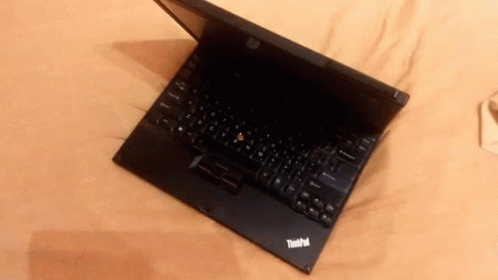

## Heya!

### I'm Ven!

I spend way too much of my free time on my Tuxpad (Get it, because its a Thinkpad with Linux on it? hahaha ha.... ha......)

Even though I have always been a huge tech enthusiast, I never owned my own laptop, so all I had was my trusted old Oneplus 3t.

And oh boy did I mod that shit! With a lot of [Magisk](https://github.com/topjohnwu/Magisk), custom roms and Termux, Android's capabilities are insane!

After finally buying my first own laptop I started coding early 2020. In other words I'm fairly new to coding, but I'm a rapid learner!

## Strengths

 

### Linux!

My daily driver is Arch Linux with [i3](https://i3wm.org/) as my window manager, [st](https://st.suckless.org/) as my terminal and [neovim](https://neovim.io/) as my text editor

I'm a true Wine Laptop Gamer!!!! (God please save me from the 2GB debug files i have to analyse)

___

### Typescript!

I started my programming journey off with javascript. My first project was a Discord bot for [a big Tencent community server I was managing at that time](https://discord.gg/arenaofvalor). A friend of mine then introduced me to typescript and I immediately fell in love with it. Types are great!! I mastered almost all Typescript features now

I'm also decent at Python and C#
___

### Free and Open Source Software!

I'm a proud privacy and FOSS freak. I use as little proprietary software as possible. I found out over time that doing so is actually a lot easier than most think, both on Android and on PC. Fuck FAANG lol

___

## Socials

- Discord: [Vendicated#0001](https://discord.com/users/343383572805058560)
- Osu!: [VenNeptury](https://osu.ppy.sh/users/17231974)
- Telegram: [Vendicated](https://t.me/Vendicated)
- Mail: [vendicated@riseup.net](mailto:vendicated@riseup.net)
- Signal: email me and I'll give you my number

 
  

   Yeah I know this README is kinda cringe. Do I care? FUCK NO

<!--

-->
